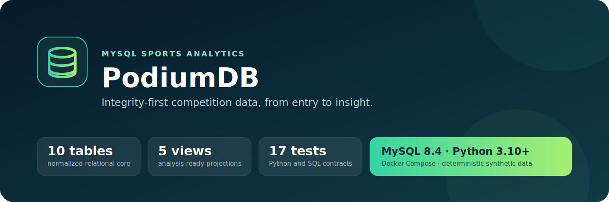
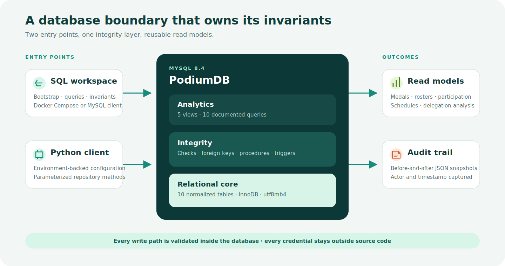

<p align="center">
  
</p>

<p align="center">
  <a href="https://github.com/Himath2002/podiumdb-mysql/actions/workflows/verification.yml"></a>
  <a href="LICENSE"></a>
  
  
</p>

PodiumDB is a normalized MySQL system for modelling competitors, teams, event entries, schedules, and medal outcomes. It treats the database as an active integrity boundary: checks, foreign keys, procedures, and triggers reject invalid writes regardless of whether they come from SQL or the typed Python client.

The included **Aurora Invitational** dataset is deterministic and entirely fictional. It makes the project safe to clone, inspect, query, reset, and test without private records or external services.

## What this project demonstrates

- **Relational modelling:** ten focused tables, explicit many-to-many membership, and polymorphic athlete/team participation with enforced exclusivity.
- **Integrity at write time:** stored procedures and triggers validate event formats, medal eligibility, recipient countries, and audit every award mutation.
- **Analysis-ready design:** five reusable views plus ten documented queries covering joins, conditional aggregation, CTEs, inclusive counts, and domain ordering.
- **Safe application integration:** environment-only credentials, parameterized Python queries, and a commit-or-rollback connection boundary.
- **Reproducible delivery:** Docker Compose bootstrap, deterministic seed data, executable invariants, unit tests, and MySQL-backed CI.

## Architecture

<p align="center">
  
</p>

The database owns the rules that must hold across every client. The Python layer stays intentionally small: configuration, transaction management, parameterized repository methods, and a CLI that exposes the most useful read models.

### Core model

| Area | Tables | Key design decision |
| --- | --- | --- |
| Delegations | `countries`, `coaches`, `athletes` | Countries are canonical parents; coaches remain optional associations |
| Teams | `teams`, `team_memberships` | Membership is a true many-to-many relationship, separate from event entry |
| Competition | `events`, `event_entries`, `event_schedules` | Each entry identifies exactly one athlete or team and must match event format |
| Results | `medal_awards`, `medal_award_audit` | Recipients must be registered entrants; all result mutations are captured |

See the [data dictionary](docs/data-dictionary.md) for relationship and integrity details, and the [analytics catalog](docs/query-catalog.md) for every view and query.

## Quick start

### Prerequisites

- Docker with Compose v2
- Python 3.10 or newer
- `make` for the convenience commands

```bash
git clone https://github.com/Himath2002/podiumdb-mysql.git
cd podiumdb-mysql
cp .env.example .env

docker compose up -d --wait

python3 -m venv .venv
source .venv/bin/activate
python -m pip install .

set -a
source .env
set +a
podiumdb medal-table
```

Docker initializes the schema, routines, synthetic dataset, and analytical views in a fresh volume. The values in `.env.example` are local-development defaults only.

### Example output

```text
country_code | country_name  | gold_medals | silver_medals | bronze_medals | total_medals
-------------+---------------+-------------+---------------+---------------+-------------
USA          | United States | 1           | 0             | 1             | 2
AUS          | Australia     | 1           | 0             | 0             | 1
GBR          | Great Britain | 1           | 0             | 0             | 1
KEN          | Kenya         | 1           | 0             | 0             | 1
FRA          | France        | 0           | 2             | 0             | 2
JPN          | Japan         | 0           | 1             | 1             | 2
CAN          | Canada        | 0           | 1             | 0             | 1
```

## Explore the system

### CLI

```bash
# Ranked delegation totals
podiumdb medal-table

# All athletes, or one delegation
podiumdb athletes
podiumdb athletes --country AUS

# Event entry totals
podiumdb events

# Validated write through a stored procedure
podiumdb register-athlete \
  --given-name Ada \
  --family-name North \
  --date-of-birth 2000-01-02 \
  --country BRA \
  --coach-id 108
```

Use `podiumdb --help` or `podiumdb <command> --help` for the complete interface.

### SQL analytics

```bash
make analytics
```

This runs the full catalog in [`sql/analytics/queries.sql`](sql/analytics/queries.sql): athlete directories, team rosters, participation summaries, medal rankings, above-average medalists, schedules, coaching workloads, recipients, and delegation sizes.

## Verification

```bash
# 17 Python unit and schema-contract tests
make python-test

# Python syntax compilation
make static-test

# MySQL checks, including rejection paths and transactional rollback
make db-test

# Complete local verification
make verify
```

The database invariant suite checks deterministic row counts, participant and recipient exclusivity, schedule chronology, medal totals, stored-procedure output, rejected invalid writes, transactional rollback, and audit consistency.

GitHub Actions repeats the Python suite on Python 3.10 and 3.13, then provisions a real MySQL 8.4 service to rebuild the database, execute every invariant and analysis query, and exercise the installed CLI.

> `make db-reset` recreates the local Docker service and deletes its PodiumDB development volume. Do not use it for data you need to retain.

## Project structure

```text
podiumdb-mysql/
├── .github/
│   ├── dependabot.yml
│   └── workflows/verification.yml
├── docs/
│   ├── assets/
│   │   ├── podiumdb-hero.svg
│   │   └── system-architecture.svg
│   ├── data-dictionary.md
│   └── query-catalog.md
├── sql/
│   ├── analytics/       # Views and analysis queries
│   ├── routines/        # Procedures, validation, and audit triggers
│   ├── schema/          # Normalized relational model
│   ├── seed/            # Fictional deterministic dataset
│   ├── tests/           # Executable database invariants
│   └── bootstrap.sql    # One-command database rebuild
├── src/podiumdb/        # Config, transactions, repository, and CLI
├── tests/               # Python unit and SQL contract tests
├── compose.yaml
├── Makefile
└── pyproject.toml
```

## Engineering decisions

- **Database-first invariants:** business-critical consistency is enforced even when a caller bypasses the Python client.
- **Separate membership and entry:** a team roster describes composition; an event entry describes participation. Conflating them would make history and multi-event reuse ambiguous.
- **Synthetic fixtures:** stable identifiers make query output and invariants reproducible while avoiding personal information.
- **Small client surface:** the CLI proves safe integration without hiding the SQL design behind a large application layer.
- **No embedded secrets:** runtime credentials are required from the environment; only clearly labelled local defaults are provided.

## Data and security

All people, competition records, and results are fictional. No production or personal dataset is included. Before any shared deployment, replace the local credentials, apply least-privileged database accounts, restrict network exposure, and review the [security policy](SECURITY.md).

## Documentation

- [Data dictionary](docs/data-dictionary.md)
- [Analytics catalog](docs/query-catalog.md)
- [Contributing guide](CONTRIBUTING.md)
- [Security policy](SECURITY.md)
- [Changelog](CHANGELOG.md)
- [Acknowledgements](ACKNOWLEDGEMENTS.md)

## License

Released under the [MIT License](LICENSE). Copyright © 2024–2026 Himath Ahangama.
